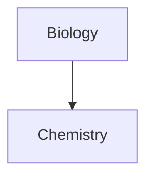
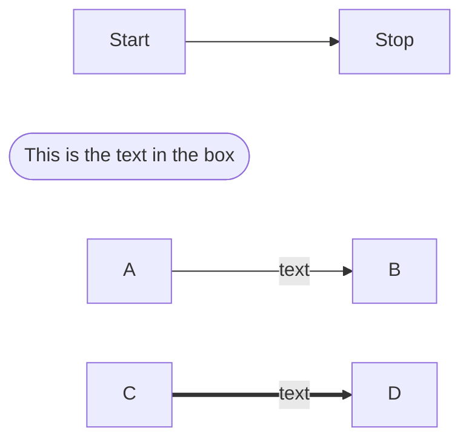

# Cloud-Engineer
This is for the Cloud Engineer Project to accomplish

1. CI/CD
2. Terraform
3. Projects
- test

__test__
*test*
~~strike~~
==highlighted==
> Human

>[!info]
# heading 1
## heading 2
###### heading 6
`code`
```js
code
```
- [x] task 1
- [] task 2



